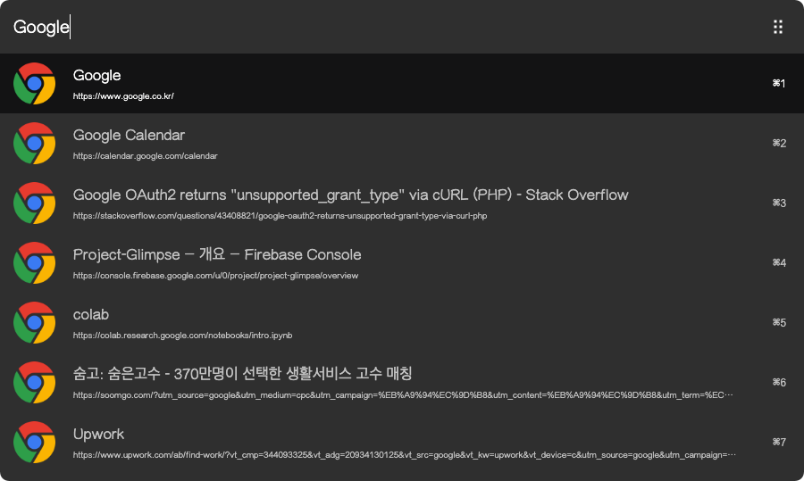

# arvis-chrome-bookmark-plugin

[](http://badge.fury.io/js/arvis-chrome-bookmark-plugin)
[](https://lbesson.mit-license.org/)
[](http://makeapullrequest.com)
[](https://GitHub.com/jopemachine/arvis-chrome-bookmark-plugin/issues/)

Search Google Chrome Bookmark in Arvis



## Installation

1. Install by npm

```
$ npm i -g arvis-chrome-bookmark-plugin
```

## Related

- [arvis-chrome-workflow](https://github.com/arvis-workflows/arvis-chrome-workflow) - Arvis workflow to search Chrome kernel based browser's queries, bookmarks, history and download logs, and other datas

- [arvish](https://github.com/jopemachine/arvish) - Arvis workflow, plugin creator tools

- [other plugins](https://github.com/jopemachine/arvis/blob/master/documents/plugin-links.md)